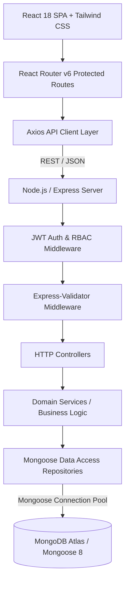
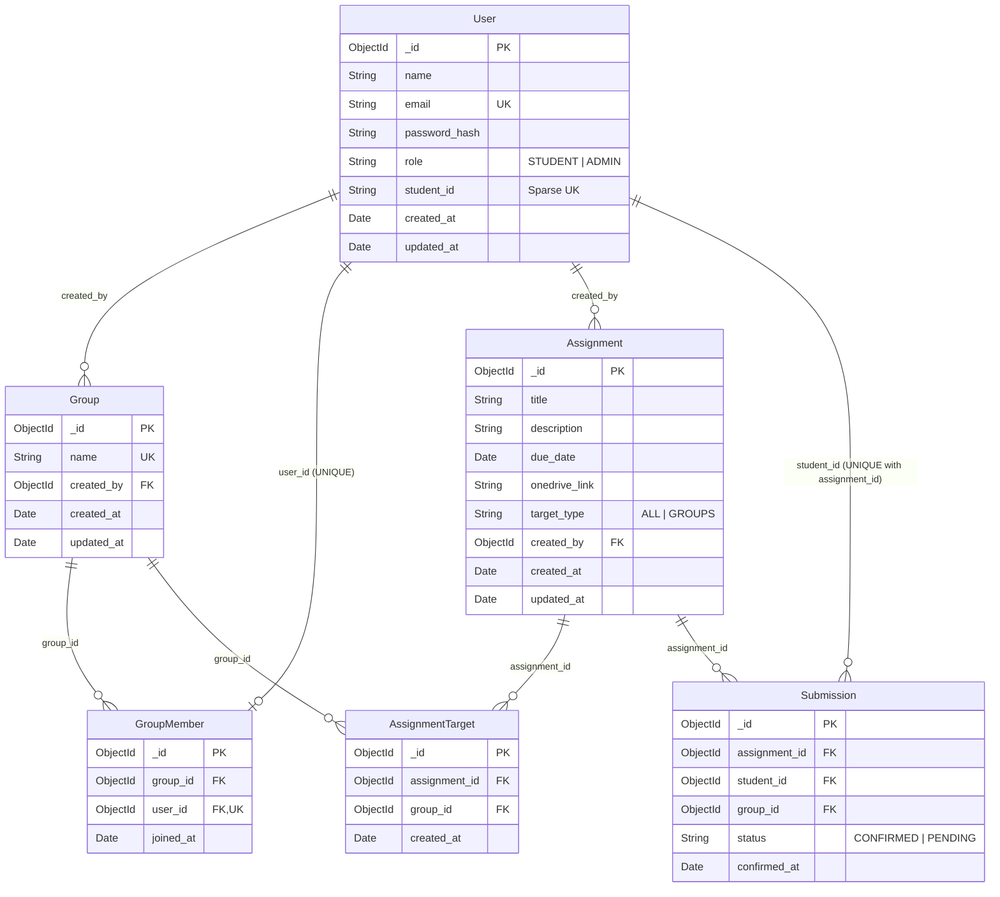

# Student, Group & Assignment Management System (Joineazy Task 1)

A production-grade, role-based **MERN Stack** (MongoDB, Express.js, React + Vite, Node.js) web application designed for academic cohorts. It empowers students to collaborate in groups, access coursework materials and OneDrive submission links, verify completion with a two-step confirmation flow, and track team progress. It provides professors and administrators with assignment targeting capabilities, real-time submission auditing, group monitoring, and executive analytics.

---

## 📺 Project Demonstration & Repository

- **GitHub Repository**: [https://github.com/MrGuptaRanjit/joineazy-task-1](https://github.com/MrGuptaRanjit/joineazy-task-1)
- **Demo Walkthrough Video**: `[ADD VIDEO LINK]`
- **Live Platform**: `[OPTIONAL / ADD DEPLOYMENT LINK]`

> 📖 **Demo Guide**: Refer to [`docs/demo-script.md`](file:///c:/Users/gupta/Desktop/AntiGravity%20Workspace/joineazy-task-1/docs/demo-script.md) for a structured 5–8 minute video walkthrough.  
> 🧠 **Interview Reference**: Refer to [`docs/interview-notes.md`](file:///c:/Users/gupta/Desktop/AntiGravity%20Workspace/joineazy-task-1/docs/interview-notes.md) for technical deep-dives into 19 architectural interview topics.

---

## 🚀 Key Features

### 🎓 Student Experience
- **Account & Profile Management**: Register and log in securely with JWT authentication and Student ID tracking.
- **Unified Academic Dashboard**: Real-time KPI summary cards (Current Group, Total Assigned, Completed, Pending, Completion Rate), upcoming deadlines tracker, and quick-action shortcuts.
- **Group Collaboration Hub**:
  - Create student group and become group leader.
  - Invite/add peer students by university email or Student ID.
  - View member roster with role badges (Leader vs Member) and joined timestamps.
  - Remove members or leave group with confirmation modal (strictly 1 active group per student).
- **Assigned Coursework Browser**:
  - Filter by `All`, `Pending`, or `Submitted`.
  - Due date indicator with overdue/due soon alerts.
  - Target badge (`All Students` vs `Group Targeted`).
  - Direct OneDrive submission folder action opening in a secure new tab.
- **Two-Step Submission Flow**:
  - *Step 1*: "Yes, I have submitted" button triggers explicit modal confirmation dialog.
  - *Step 2*: Verification checkbox certificate followed by final "Confirm Submission" API action.
  - Instant UI reflection, verified timestamp badge, and duplicate prevention.
- **Milestone & Progress Tracker**:
  - Visual completion percentage bar.
  - Achievement milestone badges ("First Submission Verified", "Halfway Milestone 50%+", "100% Completed").
  - Coursework status breakdown matrix.

### 👨‍🏫 Admin & Professor Experience
- **Strict Role-Based Security**: All `/api/admin/*` endpoints and `/admin/*` frontend routes are protected with `ADMIN` role verification (HTTP 403 returned to students).
- **Executive Admin Dashboard (`/admin/dashboard`)**:
  - Live aggregate statistics: Total Students, Total Groups, Total Assignments, Completed Submissions, Pending Confirmations, Overall Completion Rate.
  - Quick action cards, recent assignments summary, upcoming deadlines, and low-completion alerts.
- **Assignment Lifecycle Management (`/admin/assignments`)**:
  - Paginated/searchable list of all assignments with target types, due dates, submission rates, and quick actions.
  - **Create Assignment (`/admin/assignments/new`)**: Configure title, description, due date, OneDrive URL, and targeting mode (`ALL_STUDENTS` vs `SPECIFIC_GROUPS`).
  - **Edit Assignment (`/admin/assignments/:id/edit`)**: Update coursework details and modify group target links with database integrity checks.
- **Assignment Submission Audit (`/admin/assignments/:id`)**:
  - Real-time audit matrix showing targeted students, student IDs, group membership, status (`Submitted` vs `Pending`), and confirmed timestamps.
- **Group & Submission Monitoring (`/admin/groups` & `/admin/groups/:id`)**:
  - Cohort directory with group size, assignment completion percentage, and drilldown inspection.
  - Group audit detail page listing members, leader badge, and member-by-member assignment completion breakdown tree.
- **Executive Analytics Engine (`/admin/analytics`)**:
  - Interactive Recharts data visualizations:
    1. Assignment completion rate bar chart.
    2. Group performance comparison bar chart.
    3. Submission status distribution doughnut chart.
  - Full individual student performance roster with calculated completion percentages.

---

## 🛠 Technology Stack

| Layer | Technology | Purpose |
| :--- | :--- | :--- |
| **Frontend** | React 18, Vite, React Router v6, Tailwind CSS, Lucide React, Recharts, Axios | Responsive Single-Page Application with interactive charts and client-side RBAC guards |
| **Backend** | Node.js, Express.js, `express-validator`, `bcryptjs`, `jsonwebtoken` | Layered REST API (Controllers, Services, Repositories) |
| **Database** | MongoDB, Mongoose 8 | Document database with schema validation, compound indexes, ObjectId references, and aggregation pipelines |
| **Cloud Hosting** | Render (Backend), MongoDB Atlas (Database), Vercel / Netlify (Frontend) | Free-tier cloud infrastructure |

---

## 🏛 High-Level System Architecture



---

## 🗄 Database Design & Schema Relationships



---

## 🔑 Development Seed Credentials

> ⚠️ **NOTE**: These credentials are provided for **LOCAL DEVELOPMENT & DEMONSTRATION ONLY**.

| Role | Name | Email | Password | Student ID / Group |
| :--- | :--- | :--- | :--- | :--- |
| **Admin** | Prof. Alan Turing | `admin@university.edu` | `Admin123!` | — |
| **Student** | Alex Johnson | `alex@student.edu` | `Password123!` | STU1001 (Cloud Architects Alpha) |
| **Student** | Brianna Smith | `brianna@student.edu` | `Password123!` | STU1002 (Cloud Architects Alpha) |
| **Student** | Carlos Mendez | `carlos@student.edu` | `Password123!` | STU1003 (Distributed Systems Beta) |
| **Student** | Diana Prince | `diana@student.edu` | `Password123!` | STU1004 (Cloud Architects Alpha) |
| **Student** | Ethan Hunt | `ethan@student.edu` | `Password123!` | STU1005 (Distributed Systems Beta) |

---

## 🚀 Local Setup Instructions

### Prerequisites
- **Node.js**: `>= 18.0.0`
- **npm**: `>= 9.0.0`
- **MongoDB**: Local MongoDB instance (`mongodb://127.0.0.1:27017`) or MongoDB Atlas Free Tier connection string.

### 1. Clone & Configure
```bash
git clone https://github.com/MrGuptaRanjit/joineazy-task-1.git
cd joineazy-task-1
```

### 2. Backend Setup
```bash
cd backend
npm install
cp .env.example .env
```
Ensure your `backend/.env` contains:
```env
PORT=5000
NODE_ENV=development
MONGODB_URI=mongodb://127.0.0.1:27017/joineazy
JWT_SECRET=super_secret_jwt_key_please_change_in_production_32_chars_min
JWT_EXPIRES_IN=24h
CORS_ORIGIN=http://localhost:5173
```

Seed demo test accounts and assignments:
```bash
npm run db:seed
```

Start the backend development server:
```bash
npm run dev
# Or for production:
npm start
```

### 3. Frontend Setup
In a new terminal window:
```bash
cd frontend
npm install
npm run dev
```

Open [http://localhost:5173](http://localhost:5173) in your browser!

---

## 🧪 Automated Testing & Production Build

### 1. Run Backend Automated Test Suite
```bash
cd backend
npm test
```
**Results:** `32 passed, 32 total` covering Health check, Student registration & validation, Login flow, JWT RBAC, Group management, Single-group constraint, Assignment targeting, Two-step confirmation, Admin analytics, and Input security.

### 2. Run Frontend Production Build
```bash
cd frontend
npm run build
```
**Results:** Built cleanly in `<7s` with zero errors.

---

## ☁️ Free-Tier Cloud Deployment Guide

### 1. Database: MongoDB Atlas (Free M0 Tier)
1. Create a free account at [mongodb.com/atlas](https://www.mongodb.com/atlas).
2. Create an **M0 Free Cluster**.
3. Under **Database Access**, create a user (e.g. `joineazy_user` with a password).
4. Under **Network Access**, allow access from anywhere (`0.0.0.0/0`).
5. Click **Connect** $\rightarrow$ **Drivers** $\rightarrow$ Copy the connection string:
   `mongodb+srv://<username>:<password>@cluster0.mongodb.net/joineazy?retryWrites=true&w=majority`

### 2. Backend: Render Free Web Service
1. Go to [dashboard.render.com](https://dashboard.render.com) and click **New +** $\rightarrow$ **Web Service**.
2. Select your repository: `MrGuptaRanjit/joineazy-task-1`.
3. Configure:
   - **Root Directory**: `backend`
   - **Runtime**: `Node`
   - **Build Command**: `npm install`
   - **Start Command**: `npm start`
   - **Environment Variables**:
     - `NODE_ENV`: `production`
     - `PORT`: `5000`
     - `JWT_SECRET`: *(Any random 32+ character string)*
     - `JWT_EXPIRES_IN`: `24h`
     - `MONGODB_URI`: *(Your MongoDB Atlas connection string)*
     - `CORS_ORIGIN`: `*` (or your deployed Vercel frontend URL)
4. Click **Deploy Web Service**.
5. Once deployed, run `npm run db:seed` locally against your Atlas URI or trigger seeding to populate initial demo accounts.

### 3. Frontend: Vercel / Netlify
1. Go to [vercel.com](https://vercel.com) and click **Add New...** $\rightarrow$ **Project**.
2. Import `MrGuptaRanjit/joineazy-task-1`.
3. Configure:
   - **Framework Preset**: `Vite`
   - **Root Directory**: `frontend`
   - **Environment Variables**:
     - `VITE_API_BASE_URL`: `https://<YOUR-RENDER-BACKEND-URL>/api`
4. Click **Deploy**.

---

## ⚖️ Engineering Decisions & MERN Architecture Benefits

1. **Document Embedding & Normalization**: Groups, members, assignments, and submissions use Mongoose ObjectId references to preserve relational integrity with flexible JSON projections.
2. **Database-Level Unique Indexes**: The single-group constraint (`GroupMember.user_id` unique index) and duplicate submission prevention (`Submission` compound `{ assignment_id: 1, student_id: 1 }` unique index) guarantee data integrity at the database layer.
3. **Stateless JWT with RBAC**: Stateless JWT tokens enable horizontal scaling without shared session memory, while strict RBAC middleware protects admin endpoints with HTTP 403 enforcement.
4. **Resilient Local Development**: The backend automatically falls back to an embedded in-memory MongoDB engine (`MongoMemoryServer`) during tests or local offline development, allowing zero-friction onboarding.
