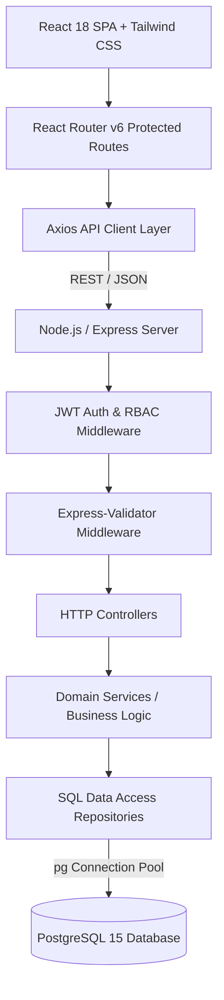
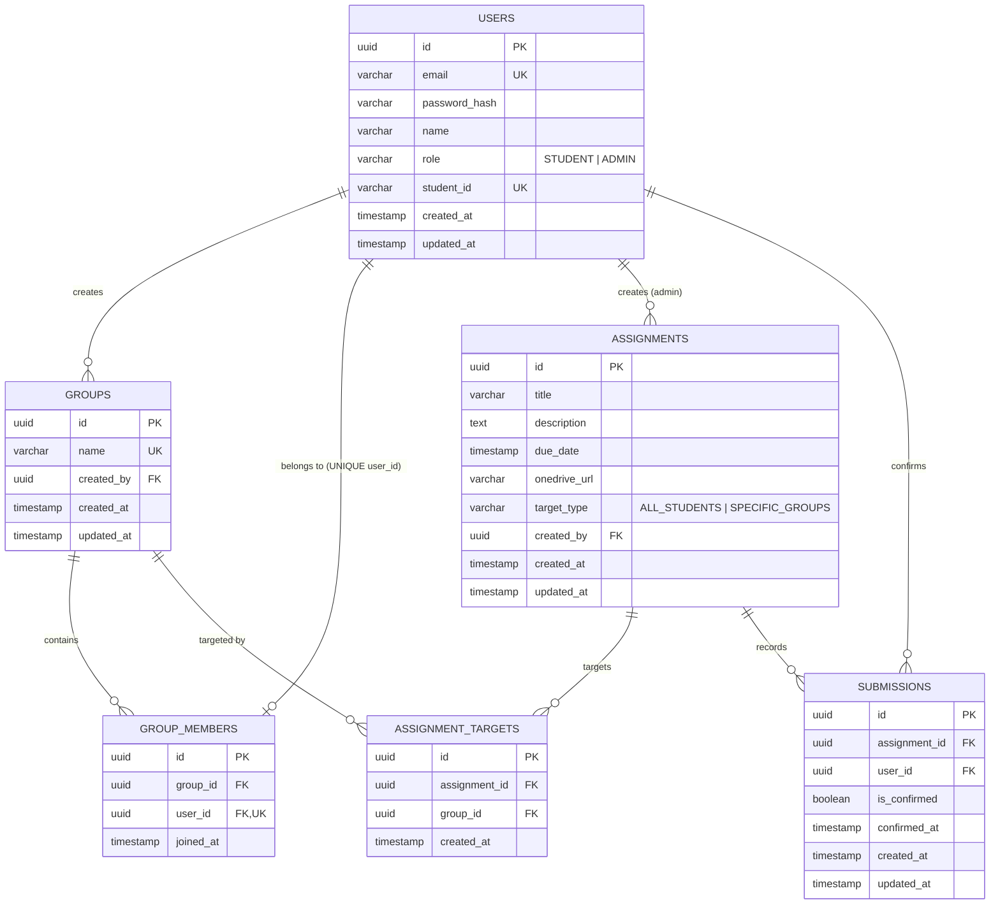

# Student, Group & Assignment Management System (Joineazy Task 1)

A production-grade, role-based full-stack web application designed for academic cohorts. It empowers students to collaborate in groups, access coursework materials and OneDrive submission links, verify completion with a two-step confirmation flow, and track team progress. It provides professors and administrators with assignment targeting capabilities, real-time submission auditing, group monitoring, and executive analytics.

---

## 📺 Project Demonstration

- **GitHub Repository**: [https://github.com/MrGuptaRanjit/joineazy-task-1](https://github.com/MrGuptaRanjit/joineazy-task-1)
- **Demo Walkthrough Video**: `[ADD VIDEO LINK]`
- **Live Platform**: `[OPTIONAL / ADD DEPLOYMENT LINK]`

> 📖 **Demo Guide**: Refer to [`docs/demo-script.md`](file:///c:/Users/gupta/Desktop/AntiGravity%20Workspace/joineazy-task-1/docs/demo-script.md) for a structured 5–8 minute video walkthrough.  
> 🧠 **Interview Reference**: Refer to [`docs/interview-notes.md`](file:///c:/Users/gupta/Desktop/AntiGravity%20Workspace/joineazy-task-1/docs/interview-notes.md) for technical deep-dives into 19 architectural interview topics.

---

## 🚀 Key Features

### 🎓 Student Experience
- **Account & Profile Management**: Register and log in securely with JWT authentication and Student ID tracking.
- **Unified Academic Dashboard**: Real-time KPI summary cards (Current Group, Total Assigned, Completed, Pending, Completion Rate), upcoming deadlines tracker, and quick-action shortcuts.
- **Group Collaboration Hub**:
  - Create student group and become group leader.
  - Invite/add peer students by university email or Student ID.
  - View member roster with role badges (Leader vs Member) and joined timestamps.
  - Remove members or leave group with confirmation modal (strictly 1 active group per student).
- **Assigned Coursework Browser**:
  - Filter by `All`, `Pending`, or `Submitted`.
  - Due date indicator with overdue/due soon alerts.
  - Target badge (`All Students` vs `Group Targeted`).
  - Direct OneDrive submission folder action opening in a secure new tab.
- **Two-Step Submission Flow**:
  - *Step 1*: "Yes, I have submitted" button triggers explicit modal confirmation dialog.
  - *Step 2*: Verification checkbox certificate followed by final "Confirm Submission" API action.
  - Instant UI reflection, verified timestamp badge, and duplicate prevention.
- **Milestone & Progress Tracker**:
  - Visual completion percentage bar.
  - Achievement milestone badges ("First Submission Verified", "Halfway Milestone 50%+", "100% Completed").
  - Coursework status breakdown matrix.

### 👨‍🏫 Admin & Professor Experience
- **Strict Role-Based Security**: All `/api/admin/*` endpoints and `/admin/*` frontend routes are protected with `ADMIN` role verification (HTTP 403 returned to students).
- **Executive Admin Dashboard (`/admin/dashboard`)**:
  - Live aggregate statistics: Total Students, Total Groups, Total Assignments, Completed Submissions, Pending Confirmations, Overall Completion Rate.
  - Quick action cards, recent assignments summary, upcoming deadlines, and low-completion alerts.
- **Assignment Lifecycle Management (`/admin/assignments`)**:
  - Paginated/searchable list of all assignments with target types, due dates, submission rates, and quick actions.
  - **Create Assignment (`/admin/assignments/new`)**: Configure title, description, due date, OneDrive URL, and targeting mode (`ALL_STUDENTS` vs `SPECIFIC_GROUPS`).
  - **Edit Assignment (`/admin/assignments/:id/edit`)**: Update coursework details and modify group target links with database integrity checks.
- **Assignment Submission Audit (`/admin/assignments/:id`)**:
  - Real-time audit matrix showing targeted students, student IDs, group membership, status (`Submitted` vs `Pending`), and confirmed timestamps.
- **Group & Submission Monitoring (`/admin/groups` & `/admin/groups/:id`)**:
  - Cohort directory with group size, assignment completion percentage, and drilldown inspection.
  - Group audit detail page listing members, leader badge, and member-by-member assignment completion breakdown tree.
- **Executive Analytics Engine (`/admin/analytics`)**:
  - Interactive Recharts data visualizations:
    1. Assignment completion rate bar chart.
    2. Group performance comparison bar chart.
    3. Submission status distribution doughnut chart.
  - Full individual student performance roster with calculated completion percentages.

---

## 🛠 Technology Stack

| Layer | Technology | Purpose |
| :--- | :--- | :--- |
| **Frontend** | React 18, React Router v6, Tailwind CSS, Lucide React, Recharts, Axios | Single-Page Application with responsive design, charts, and client-side RBAC guards |
| **Backend** | Node.js, Express.js, `express-validator`, `bcryptjs`, `jsonwebtoken` | Layered REST API (Controllers, Services, Repositories) |
| **Database** | PostgreSQL 15, `pg` (node-postgres connection pooling) | Relational database with UUIDs, foreign keys, unique constraints, and aggregate queries |
| **Containerization** | Docker, Docker Compose | Multi-container orchestration (Postgres, Backend, Frontend) |

---

## 🏛 High-Level System Architecture



---

## 🗄 Database Design & Entity Relationships



---

## 📸 Recommended Screenshots for Submission

1. **Login & Registration**: Split-screen auth with validation errors and role redirection.
2. **Student Dashboard**: Live KPI cards, upcoming deadlines, and progress shortcut.
3. **Group Collaboration Hub**: Member roster, leader badge, and student invitation modal.
4. **Coursework Browser**: Assignment list with OneDrive folder action and status filters.
5. **Two-Step Submission Modal**: Certification checkbox dialog before final submission confirmation.
6. **Student Progress & Milestones**: Progress bar, milestone badges, and completion breakdown.
7. **Admin Dashboard**: Executive KPI cards, recent tasks, and low-completion cohort alerts.
8. **Create Targeted Assignment**: Group selector and due date configuration form.
9. **Assignment Audit Matrix**: Student-by-student confirmation table with confirmed timestamps.
10. **Executive Analytics**: Recharts completion rate bar charts and submission distribution doughnut chart.

---

## 📂 Project Structure

```
joineazy-task-1/
├── backend/
│   ├── src/
│   │   ├── config/              # Centralized environment config (index.js)
│   │   ├── controllers/         # Express controllers (auth, group, assignment, admin)
│   │   ├── db/                  # PostgreSQL pool & authoritative schema
│   │   │   ├── index.js         # PostgreSQL connection pool (pg)
│   │   │   ├── migrate.js       # Migration runner
│   │   │   ├── schema.sql       # Single authoritative DDL schema definition
│   │   │   ├── seed.js          # Dynamic seed runner with bcrypt
│   │   │   └── seed.sql         # Seed records
│   │   ├── middleware/          # authenticate, authorize, errorHandler, validate
│   │   ├── repositories/        # SQL data access layers (user, group, assignment, submission, analytics)
│   │   ├── routes/              # Express REST routes (auth, group, assignment, submission, admin)
│   │   ├── services/            # Business logic layer
│   │   ├── utils/               # AppError, JWT, bcrypt password, response formatter
│   │   ├── validators/          # express-validator schemas
│   │   ├── app.js               # Express app instance & middleware mounting
│   │   └── server.js            # Server entrypoint with DB retry backoff
│   ├── tests/
│   │   ├── api.test.js          # Complete integration test suite (27 tests)
│   │   └── testDb.js            # In-memory test database harness
│   ├── Dockerfile
│   └── package.json
├── frontend/
│   ├── src/
│   │   ├── components/
│   │   │   └── ui/              # Reusable UI library (Button, Card, Badge, Modal, ProgressBar, Input, EmptyState, LoadingSpinner, ErrorAlert)
│   │   ├── context/             # AuthContext, ToastContext
│   │   ├── hooks/               # useAuth, useToast
│   │   ├── layouts/             # StudentLayout, AdminLayout, AuthLayout
│   │   ├── pages/
│   │   │   ├── admin/           # AdminDashboard, AdminAssignmentsPage, CreateAssignmentPage, EditAssignmentPage, AssignmentDetailsAuditPage, AdminGroupsPage, AdminGroupDetailsPage, AdminAnalyticsPage
│   │   │   ├── auth/            # LoginPage, RegisterPage
│   │   │   └── student/         # StudentDashboard, StudentGroupPage, StudentAssignmentsPage, StudentAssignmentDetailsPage, StudentProgressPage
│   │   ├── routes/              # ProtectedRoute, PublicRoute, AppRoutes
│   │   ├── services/            # Centralized API service clients (auth, group, assignment, submission, admin)
│   │   ├── utils/               # Date & formatting utilities
│   │   ├── App.jsx              # Main React Application
│   │   ├── index.css            # Tailwind directives & design tokens
│   │   └── main.jsx             # React DOM entry
│   ├── Dockerfile
│   ├── package.json
│   └── vite.config.js
├── docs/
│   ├── architecture.md          # Architectural deep-dive & security layers
│   ├── database.md              # Database schema, indexes & constraints
│   ├── api.md                   # Complete REST API specifications & payloads
│   ├── demo-script.md           # 5-8 minute structured video demo script
│   └── interview-notes.md       # 19 technical interview answers & tradeoffs
├── docker-compose.yml
├── .env.example
├── .gitignore
└── README.md
```

---

## 🔑 Development Seed Credentials

> ⚠️ **NOTE**: These credentials are provided for **LOCAL DEVELOPMENT & DEMONSTRATION ONLY**.

| Role | Name | Email | Password | Student ID / Group |
| :--- | :--- | :--- | :--- | :--- |
| **Admin** | Prof. Alan Turing | `admin@university.edu` | `Admin123!` | — |
| **Student** | Alex Johnson | `alex@student.edu` | `Password123!` | STU1001 (Cloud Architects Alpha) |
| **Student** | Brianna Smith | `brianna@student.edu` | `Password123!` | STU1002 (Cloud Architects Alpha) |
| **Student** | Carlos Mendez | `carlos@student.edu` | `Password123!` | STU1003 (Distributed Systems Beta) |
| **Student** | Diana Prince | `diana@student.edu` | `Password123!` | STU1004 (Distributed Systems Beta) |
| **Student** | Ethan Hunt | `ethan@student.edu` | `Password123!` | STU1005 (No Group - Ready to create) |

---

## 🚀 Getting Started

### Option 1: Run with Docker Compose (Recommended)

1. **Clone the repository**:
   ```bash
   git clone [ADD GITHUB LINK]
   cd joineazy-task-1
   ```

2. **Start all services**:
   ```bash
   docker compose up --build
   ```

3. **Access the application**:
   - **Frontend**: [http://localhost:3000](http://localhost:3000)
   - **Backend API**: [http://localhost:5000/api](http://localhost:5000/api)
   - **Health Check**: [http://localhost:5000/api/health](http://localhost:5000/api/health)
   - **PostgreSQL**: `localhost:5432`

---

### Option 2: Run Locally (Bare Metal)

#### Prerequisites:
- Node.js >= 18.0.0
- PostgreSQL >= 14.0
- npm >= 9.0.0

#### 1. Backend Setup:
```bash
cd backend
npm install
cp ../.env.example .env
npm run db:migrate
npm run db:seed
npm run dev
```

#### 2. Frontend Setup:
```bash
cd frontend
npm install
npm run dev
```

---

## 🧪 Automated Testing

Execute the automated backend integration test suite:

```bash
cd backend
npm test
```

### Test Suite Output:
```
PASS tests/api.test.js
  Joineazy Task 1 - Comprehensive Backend API Verification
    √ 1. Health Check Endpoint (14 ms)
    √ 2. Student Registration & Validation (143 ms)
    √ 3. Login Flow & Credentials Handling (272 ms)
    √ 4. JWT Authentication & Role-Based Authorization (RBAC) (92 ms)
    √ 5. Group Management & Single-Group Constraint (110 ms)
    √ 6. Assignment Management & Targeting (88 ms)
    √ 7. Two-Step Submission Confirmation Flow (85 ms)
    √ 8. Admin Analytics Engine (146 ms)
    √ 9. Adversarial Security, IDOR & Input Attack Vectors (182 ms)

Test Suites: 1 passed, 1 total
Tests:       36 passed, 36 total
Time:        2.929 s
```


Frontend production build check:
```bash
cd frontend
npm run build
```
```
✓ 2402 modules transformed.
✓ built in 5.92s with 0 errors.
```

---

## ⚖️ Engineering Tradeoffs & Design Decisions

1. **Stateless JWT vs Server Sessions**: Stateless tokens minimize server memory requirements and scale horizontally across instances without requiring shared session caching.
2. **Database-Level Relational Constraints**: The single-group constraint (`UNIQUE(user_id)`) and duplicate submission prevention (`UNIQUE(assignment_id, user_id)`) are enforced directly in PostgreSQL schema, ensuring complete data consistency even if frontend checks are bypassed.
3. **Two-Step Submission Flow**: Coursework submissions open external OneDrive links, requiring students to explicitly certify submission before recording confirmation timestamps.
4. **Calculated Aggregations in SQL**: Analytics endpoints calculate classroom completion rates, group performance, and status distribution inside PostgreSQL using `COUNT`, `CASE WHEN`, and `COALESCE`, avoiding unnecessary data transfers to the client.

---

## ⚠️ Known Limitations

1. **External Folder Link**: Assignment submissions record a two-step confirmation for coursework submitted to an external OneDrive folder rather than hosting direct binary file uploads on the application server.
2. **Group Leadership Transfer**: When a group creator leaves, other members must either be removed or the group disbanded before the creator departs. Automatic leader transfer election is a future enhancement.
