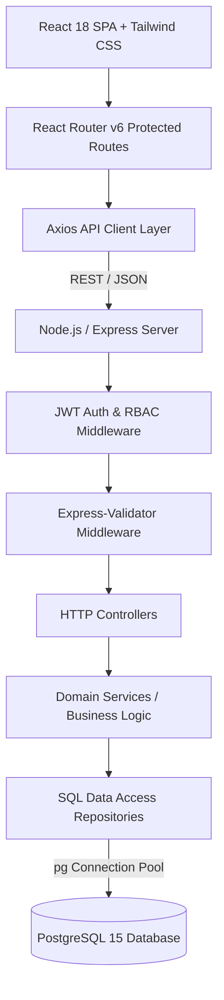

# System Architecture

The **Joineazy Student, Group & Assignment Management System** is structured as a layered, role-based full-stack architecture adhering to separation of concerns, strict boundary verification, and atomic transactional integrity.

---

## 🏛 High-Level Architecture Overview

---

## 🔒 Security & Authorization Architecture

### 1. Stateless Authentication
- User login generates a cryptographically signed **JSON Web Token (JWT)** using `HMAC SHA-256`.
- Payloads contain `id` and `role` (`STUDENT` or `ADMIN`).
- Client stores the token in `localStorage` and attaches it via HTTP `Authorization: Bearer <token>` header through an Axios request interceptor.

### 2. Role-Based Access Control (RBAC)
- **Authentication Middleware (`auth.middleware.js`)**: Verifies token presence, checks expiration, decrypts claims, and injects `req.user`.
- **Authorization Guard (`authorize('ADMIN')`)**: Restricts executive admin endpoints. Students attempting access immediately receive **HTTP 403 Forbidden**.
- **Frontend Role Routing (`ProtectedRoute.jsx`)**: Enforces client-side routing bounds to prevent unauthorized screen flashing while relying on backend status codes as the authoritative source of truth.

### 3. IDOR & Resource Ownership Protections
- **Group Modification**: Only active members of a group can invite new peers.
- **Group Removal**: Only the group creator can remove other members; individual members can only remove themselves (leave). Group creators cannot leave while other members remain without transferring or disbanding.
- **Submissions**: Submissions are tied to the authenticated user ID (`req.user.id`). Students can only confirm assignments explicitly visible to them.

---

## 📁 Layer Responsibilities

| Layer | Responsibility | File Path Reference |
| :--- | :--- | :--- |
| **Presentation (UI)** | Responsive components, visual state machines (loading, empty, error, success), interactive Recharts. | `frontend/src/pages/`, `frontend/src/components/` |
| **Client Services** | Centralized Axios HTTP abstractions, token management, error unwrap. | `frontend/src/services/` |
| **Routing & Middleware** | HTTP route mapping, rate limiting/CORS, JWT extraction, validation error interceptors. | `backend/src/routes/`, `backend/src/middleware/` |
| **Controllers** | Request payload unmarshaling, calling domain services, dispatching standard JSON envelopes. | `backend/src/controllers/` |
| **Domain Services** | Business rules enforcement, workflow orchestration, access control logic. | `backend/src/services/` |
| **Repositories** | Direct parameterized SQL statements, connection pooling, transactional isolation. | `backend/src/repositories/` |
| **Persistence (DB)** | PostgreSQL schema, relational integrity, unique constraints, check constraints. | `backend/src/db/schema.sql` |
