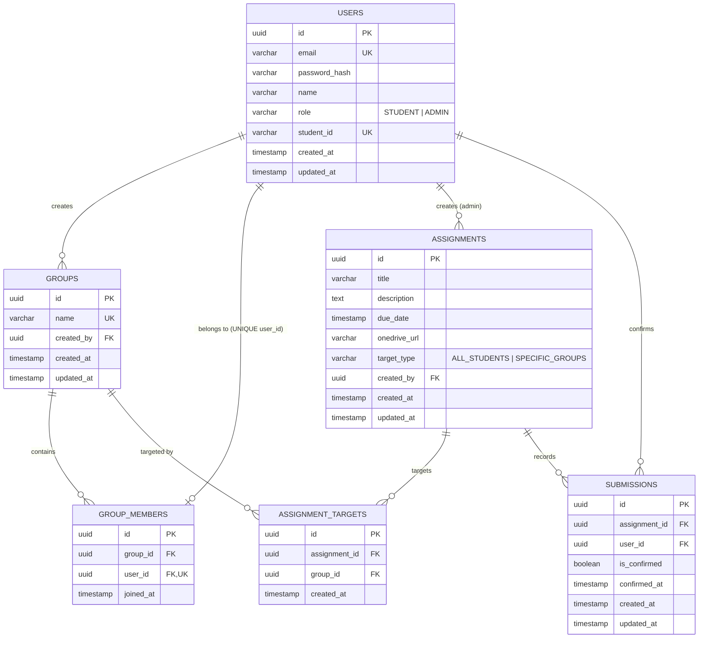

# Database Design & Relational Schema

The database for the **Student, Group & Assignment Management System** is powered by PostgreSQL 15. The schema is single-sourced in `backend/src/db/schema.sql` to avoid competing or out-of-sync migrations.

---

## 🏛 Entity Relationship Diagram

---

## 📋 Table Definitions & Constraints

### 1. `users` Table
Stores authenticated system users with role assignment.
- `id` (UUID, Primary Key, default `gen_random_uuid()`)
- `email` (VARCHAR(255), NOT NULL, UNIQUE)
- `password_hash` (VARCHAR(255), NOT NULL)
- `name` (VARCHAR(255), NOT NULL)
- `role` (VARCHAR(50), NOT NULL, CHECK `role IN ('STUDENT', 'ADMIN')`)
- `student_id` (VARCHAR(100), NULLABLE, UNIQUE)
- `created_at`, `updated_at` (TIMESTAMP WITH TIME ZONE)

### 2. `groups` Table
Stores collaborative student cohorts created by student leaders.
- `id` (UUID, Primary Key)
- `name` (VARCHAR(255), NOT NULL, UNIQUE)
- `created_by` (UUID, NOT NULL, FOREIGN KEY -> `users(id)` ON DELETE CASCADE)
- `created_at`, `updated_at` (TIMESTAMP WITH TIME ZONE)

### 3. `group_members` Table
Associates students with their respective group.
- `id` (UUID, Primary Key)
- `group_id` (UUID, NOT NULL, FOREIGN KEY -> `groups(id)` ON DELETE CASCADE)
- `user_id` (UUID, NOT NULL, UNIQUE, FOREIGN KEY -> `users(id)` ON DELETE CASCADE)
- `joined_at` (TIMESTAMP WITH TIME ZONE)
> **Single-Group Guarantee**: The constraint `UNIQUE(user_id)` mathematically guarantees that a student can belong to at most one group at any time.

### 4. `assignments` Table
Stores coursework tasks posted by professors.
- `id` (UUID, Primary Key)
- `title` (VARCHAR(255), NOT NULL)
- `description` (TEXT)
- `due_date` (TIMESTAMP WITH TIME ZONE, NOT NULL)
- `onedrive_url` (VARCHAR(1024), NOT NULL)
- `target_type` (VARCHAR(50), NOT NULL, CHECK `target_type IN ('ALL_STUDENTS', 'SPECIFIC_GROUPS')`)
- `created_by` (UUID, NOT NULL, FOREIGN KEY -> `users(id)`)
- `created_at`, `updated_at` (TIMESTAMP WITH TIME ZONE)

### 5. `assignment_targets` Table
Junction table linking group-targeted assignments to specific student groups.
- `id` (UUID, Primary Key)
- `assignment_id` (UUID, NOT NULL, FOREIGN KEY -> `assignments(id)` ON DELETE CASCADE)
- `group_id` (UUID, NOT NULL, FOREIGN KEY -> `groups(id)` ON DELETE CASCADE)
- `created_at` (TIMESTAMP WITH TIME ZONE)
- `UNIQUE(assignment_id, group_id)`

### 6. `submissions` Table
Stores student confirmation records.
- `id` (UUID, Primary Key)
- `assignment_id` (UUID, NOT NULL, FOREIGN KEY -> `assignments(id)` ON DELETE CASCADE)
- `user_id` (UUID, NOT NULL, FOREIGN KEY -> `users(id)` ON DELETE CASCADE)
- `is_confirmed` (BOOLEAN, NOT NULL, DEFAULT TRUE)
- `confirmed_at` (TIMESTAMP WITH TIME ZONE, NOT NULL)
- `created_at`, `updated_at` (TIMESTAMP WITH TIME ZONE)
- `UNIQUE(assignment_id, user_id)` (Prevents duplicate confirmations)

---

## ⚡ Indexing Strategy

To ensure zero-lag queries under high concurrency, indexes are defined on foreign keys and lookup columns:
- `idx_users_email` ON `users(email)`
- `idx_users_student_id` ON `users(student_id)`
- `idx_group_members_group` ON `group_members(group_id)`
- `idx_group_members_user` ON `group_members(user_id)`
- `idx_assignment_targets_assignment` ON `assignment_targets(assignment_id)`
- `idx_assignment_targets_group` ON `assignment_targets(group_id)`
- `idx_submissions_assignment` ON `submissions(assignment_id)`
- `idx_submissions_user` ON `submissions(user_id)`
