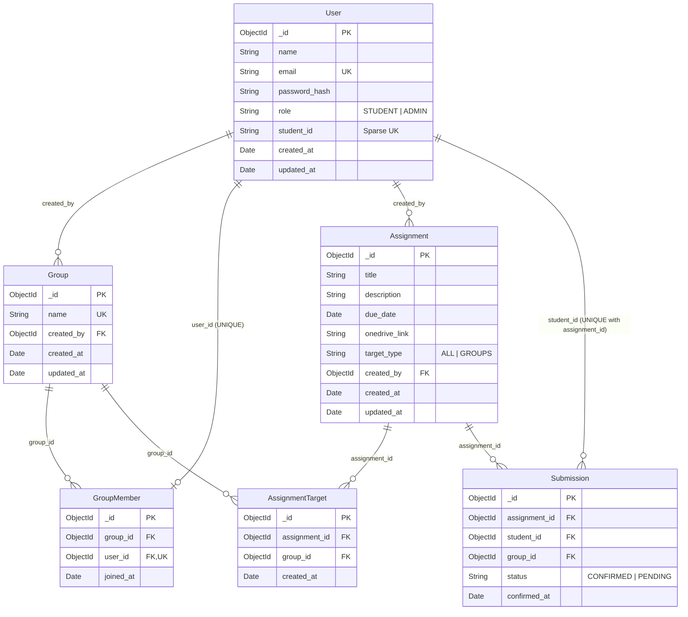

# Database Design & Mongoose Schema Architecture

The database for the **Student, Group & Assignment Management System** is powered by **MongoDB & Mongoose 8**. All schemas enforce strict validation, compound indexes, unique constraints, and ObjectId references to ensure complete relational data integrity.

---

## 🏛 Entity Relationship Diagram

---

## 📋 Collection Specifications

### 1. `User` Collection (`users`)
- `_id`: `ObjectId` primary key
- `name`: `String`, required, max 255 chars
- `email`: `String`, required, unique, lowercase
- `password_hash`: `String`, required bcrypt hash
- `role`: `String`, enum `['STUDENT', 'ADMIN']`, default `'STUDENT'`
- `student_id`: `String`, uppercase, sparse unique index (required for students, null for admin)
- `created_at`, `updated_at`: `Date` timestamps

### 2. `Group` Collection (`groups`)
- `_id`: `ObjectId` primary key
- `name`: `String`, required, unique, min 3 max 150 chars
- `created_by`: `ObjectId` ref `'User'`
- `created_at`, `updated_at`: `Date` timestamps

### 3. `GroupMember` Collection (`groupmembers`)
- `_id`: `ObjectId` primary key
- `group_id`: `ObjectId` ref `'Group'`
- `user_id`: `ObjectId` ref `'User'`, **unique: true** (strictly enforces 1 group per student)
- `joined_at`: `Date` timestamp

### 4. `Assignment` Collection (`assignments`)
- `_id`: `ObjectId` primary key
- `title`: `String`, required, min 3 max 255 chars
- `description`: `String`, required
- `due_date`: `Date`, required
- `onedrive_link`: `String`, required valid URL
- `target_type`: `String`, enum `['ALL', 'GROUPS']`, default `'ALL'`
- `created_by`: `ObjectId` ref `'User'`
- `created_at`, `updated_at`: `Date` timestamps

### 5. `AssignmentTarget` Collection (`assignmenttargets`)
- `_id`: `ObjectId` primary key
- `assignment_id`: `ObjectId` ref `'Assignment'`
- `group_id`: `ObjectId` ref `'Group'`
- Compound unique index: `{ assignment_id: 1, group_id: 1 }`
- `created_at`: `Date` timestamp

### 6. `Submission` Collection (`submissions`)
- `_id`: `ObjectId` primary key
- `assignment_id`: `ObjectId` ref `'Assignment'`
- `student_id`: `ObjectId` ref `'User'`
- `group_id`: `ObjectId` ref `'Group'` (optional)
- `status`: `String`, enum `['CONFIRMED', 'PENDING']`, default `'CONFIRMED'`
- `confirmed_at`: `Date` timestamp
- Compound unique index: `{ assignment_id: 1, student_id: 1 }` (prevents duplicate confirmations)
